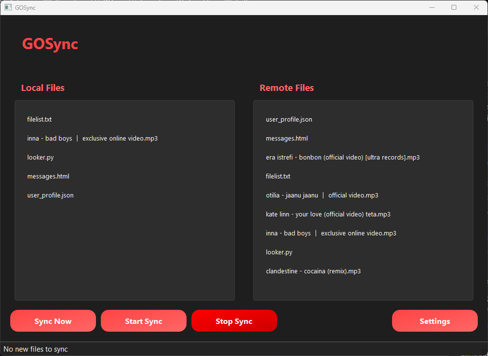
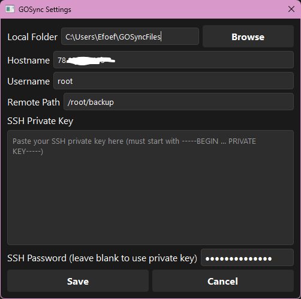

<p align="center">
  
</p>

<div align="center">

[](LICENSE)
[](https://www.python.org)
[](https://github.com/yourusername/GOSync)
[](https://wiki.qt.io/Qt_for_Python)
[](https://github.com/yourusername/GOSync)
[](https://github.com/yourusername/GOSync)

</div>

# GOSync - Secure File Backup Application

GOSync is a desktop application that enables secure file backup and synchronization over SSH.

## ✨ Key Features

### 🔒 Security
- SSH key-based authentication support
- Password-based authentication option
- Encrypted configuration storage
- Secure file transfer over SSH/SCP

### 🔄 Synchronization
- 🕒 Automatic sync with 10-second interval
- 🚀 Manual "Sync Now" option
- 📊 Real-time progress tracking
- 🔍 Smart file change detection

### 📁 File Management
- 🖱️ Drag & drop file support
- 📥 Download files from server
- 📤 Upload files to server
- 🗑️ Delete local files
- 🔄 Refresh file lists

### 💻 User Interface
- 🎨 Modern dark theme with custom styling
- 🖥️ Dual-pane file view (Local/Remote)
- 🔔 System tray integration with notifications
- ⚙️ Easy-to-use settings dialog

### 🛠️ Technical Features
- 🎯 Single instance application support
- 🌐 Cross-platform (Windows/Linux)
- 📝 Detailed logging system
- 🔌 Automatic reconnection handling

## 📸 Screenshots

### Main Window
<p align="center">
  
  <br>
  <em>Main interface showing local and remote file synchronization panels</em>
</p>

### Settings Dialog
<p align="center">
  
  <br>
  <em>Settings window for configuring SSH connection and sync preferences</em>
</p>

## 🚀 Installation

### System Requirements
- Windows or Linux operating system
- Python 3.8 or higher
- pip (Python package manager)

### Dependencies
```bash
pip install -r requirements.txt
```

Required packages:
- PySide6 >= 6.6.1 (GUI framework)
- paramiko >= 3.4.0 (SSH client)
- cryptography >= 42.0.2 (Encryption)
- scp >= 0.14.5 (File transfer)

## 🔧 Configuration

Settings are automatically saved in:
- Windows: `%APPDATA%\GOSync`
- Linux: `~/.config/GOSync`

## 📖 Usage Guide

### Initial Setup
1. Launch GOSync
2. Click "Settings" to configure:
   - SSH server details (hostname, username)
   - Authentication (SSH key or password)
   - Local and remote sync folders

### Sync Operations
- 🟢 Start Sync: Begin automatic synchronization
- 🔄 Sync Now: Perform immediate sync
- 🔴 Stop Sync: Pause synchronization

### File Operations
- Right-click on local files:
  - Upload to Server
  - Delete
- Right-click on remote files:
  - Download to Local
  - Refresh List

### System Tray
- Double-click: Show/hide window
- Right-click menu:
  - Show window
  - Quick sync
  - Access settings
  - Quit application

## 🤝 Contributing

1. Fork the repository
2. Create a feature branch
3. Commit your changes
4. Push to the branch
5. Create a Pull Request

## 📄 License

This project is licensed under the Apache License 2.0 - see the [LICENSE](LICENSE) file for details. 